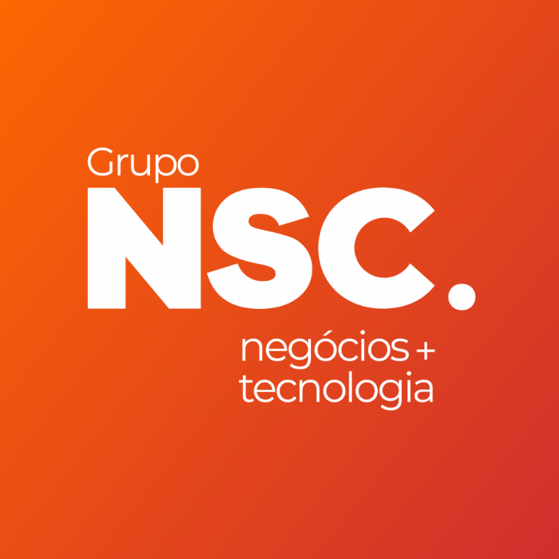

# Hello World👋

  My name is Diogo, a person passionate about technology and challenges.

  I am currently studying a Bachelor's degree in Computer Science and working in the area of ​​information technology as a web developer intern.

  

  

## Technologies and Frameworks 💻

Technologies I use in my work and personal projects 👇

  
   
   
   
   
   
   

   

### Operational systems

   
   

## Experience ✅

   
   

    <strong>Web Development Intern</strong>
   
Grupo NSC - Short Time and Hybrid (2023 - at the moment)
   

   

    Technologies : JavaScript, VueJS, Html, Css, NodeJS.
   

   

   

## Where can you find me?

